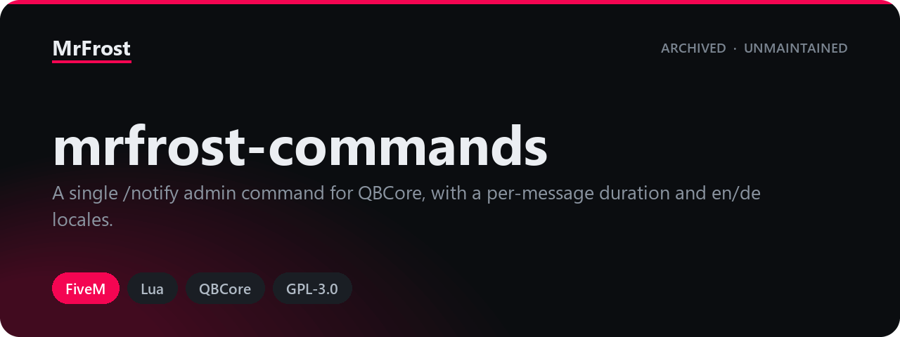

<p align="center">
  
</p>

# mrfrost-commands

<p align="left">
  
  
  
  
  
  
  
  
</p>

A staff command for QBCore servers. `/notify` sends one player a notification
with a message and a display time chosen by the sender, and reports back to the
sender whether it arrived. The command name and the permission level it needs
are configurable, and its own labels ship in English and German.

The name is plural because the resource was meant to collect more commands over
time. It never did — there is exactly one, and there will not be a second.

*Published as-is and no longer actively maintained — issues and PRs may not get a response.*

## Background

These scripts were written for a private GTA V roleplay server and ran there in
production. They are published here so the work stays available rather than
sitting on a disk, and so anyone who finds them useful can build on them.

Because they were built for one specific server rather than for general release,
they expect another resource that is **not** included here. You will need to
supply it yourself, or adapt the code around it:

- `qb-core`

## Requirements

| Resource | Required | Why |
|---|---|---|
| [qb-core](https://github.com/qbcore-framework/qb-core) | yes | Declared in `fxmanifest.lua` as a hard dependency, so the resource does not start without it. `@qb-core/shared/locale.lua` is loaded as a shared script for the `Lang` object, the command is registered through `QBCore.Commands.Add`, the target is looked up with `QBCore.Functions.GetPlayer`, and both notifications are sent as `QBCore:Notify`. |

The manifest declares `fx_version "cerulean"`, `game "gta5"` and `lua54 "yes"`, so a
reasonably current FiveM server build is needed.

No SQL, no inventory items, no exports and no NUI of its own.

## Installation

1. Copy the `mrfrost-commands` folder into your server's `resources/` directory.
2. Add `ensure mrfrost-commands` to your `server.cfg`.
3. Start `qb-core` before it.
4. Review `config.lua`. The default permission level is `mod`, so whoever is to
   use the command needs the `qbcore.mod` principal — see
   [docs/configuration.md](docs/configuration.md).
5. Optionally set `setr qb_locale "de"` in your `server.cfg` for the German label
   set; see [docs/localisation.md](docs/localisation.md).

## The command

```
/notify [ID] [duration] [message]
```

| Argument | Type | Meaning |
|---|---|---|
| `ID` | number | Server id of the player who receives the notification. |
| `duration` | number | How long it stays on screen, in seconds. |
| `message` | text | Everything after the duration, joined back together with single spaces. |

`/notify 3 8 the shop is closing in five minutes` puts that line on player 3's
screen for eight seconds and tells the sender it arrived.

Neither number is checked before it is used: a duration that is not a number
ends the command with a Lua error, and the "no player" reply names the wrong
thing. Both are written up in [docs/known-issues.md](docs/known-issues.md).

The full contract — argument handling, the two outgoing notifications and the
permission wiring — is in [docs/commands.md](docs/commands.md).

## Configuration

Everything lives in `config.lua`, and it is two keys.

| Key | Type | Default | What it does |
|---|---|---|---|
| `Config.CommandNameNotify` | string | `'notify'` | The command as typed in chat, without the slash. |
| `Config.CommandPermissionNotify` | string | `'mod'` | The QBCore permission level required to run it. |

The levels QBCore ships with, how the permission is granted, and what changes if
you set this to `user`, are in [docs/configuration.md](docs/configuration.md).

## Documentation

| Page | Contents |
|---|---|
| [docs/commands.md](docs/commands.md) | The command contract: arguments, the notifications it sends, and how it is registered. |
| [docs/configuration.md](docs/configuration.md) | Both config keys, with type, default and effect, and how the permission is granted. |
| [docs/localisation.md](docs/localisation.md) | The `locales/` keys, how the language is selected, and what is not translatable. |
| [docs/known-issues.md](docs/known-issues.md) | Findings from a read-through of the source. |

## Licence

[GPL-3.0](LICENSE)
